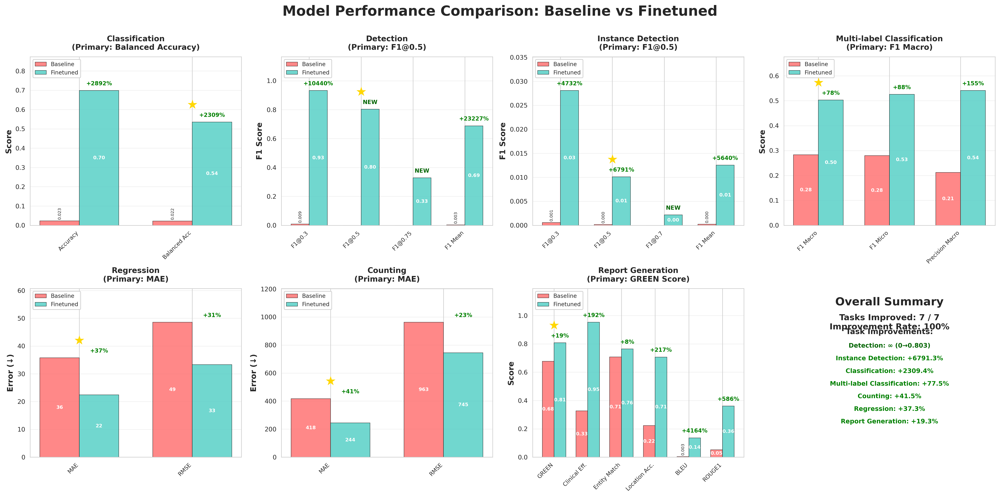

# FLARE 2025 2D MLLM Qwen3-VL Fine-tuning

This repository provides a finetuning implementation for the Qwen/Qwen2.5-VL-7B-Instruct specifically optimized for medical image analysis tasks in the FLARE 2025 2D Medical Multimodal Dataset challenge.

## 🚀 Quick Start with Pre-trained Model

The pre-trained baseline model is available at:

🤗 **Model**: [leoyinn/qwen3vl-flare25](https://huggingface.co/leoyinn/qwen3vl-flare25)

---
## Overview

This project adapts the official Qwen3-VL finetuning framework for medical multimodal vision-language tasks across 19 datasets in 8 medical imaging modalities from the FLARE 2025 challenge.

### Supported Modalities and Datasets

The pipeline supports all 19 datasets across 8 medical imaging modalities:
- **Retinography**: retino, fundus
- **Ultrasound**: BUSI-det, BUS-UCLM-det, BUSI, BUS-UCLM, iugc
- **X-ray**: boneresorption, dental, periapical, IU_XRay, chestdr
- **Clinical**: neojaundice
- **Microscopy**: chromosome, neurips22cell, bone_marrow
- **Endoscopy**: endo
- **Dermatology**: bcn20000
- **Mammography**: CMMD

### Supported Task Types
- Classification (Balanced Accuracy)
- Multi-label Classification (F1 Score)
- Detection (F1 Score @ IoU 0.5)
- Instance Detection (F1 Score @ IoU 0.3/0.5)
- Cell Counting (Mean Absolute Error)
- Regression (Mean Absolute Error)
- Report Generation (Comprehensive GREEN Score)

## Key Components

1. **Qwen3-VL/**: Official Qwen3-VL codebase with finetuning framework
2. **data_conversion/**: Scripts to convert FLARE dataset to Qwen3-VL format
3. **organized_dataset/**: FLARE 2025 medical imaging datasets (not included, see Dataset Access)

## Qwen3-VL Architecture Highlights

**Qwen3-VL** brings significant improvements over Qwen2.5-VL:
- **Interleaved-MRoPE**: Better video and multi-image reasoning
- **DeepStack Fusion**: Multi-level ViT features for fine-grained details
- **Patch Size**: 16x16 (vs 14x14 in Qwen2.5-VL)
- **Better Video Support**: Temporal timestamp alignment
- **Model Size**: 4B parameters (efficient for training)

## Requirements

- Python 3.10+
- CUDA 11.8+ with GPU (minimum 24GB VRAM recommended)
- 100GB+ free disk space for datasets and models
- [uv](https://github.com/astral-sh/uv) package manager (recommended)

## Installation

### Using uv (Recommended)

```bash
# Clone the repository
git clone https://github.com/medfm-flare/FLARE25-QWen3VL-4B.git
cd FLARE25-QWen3VL-4B

# Install uv if not already installed
curl -LsSf https://astral.sh/uv/install.sh | sh

# Install dependencies
uv sync
```

## Quick Start

### 1. Download Dataset

Download the [FLARE 2025 2D MLLM dataset](https://huggingface.co/datasets/FLARE-MedFM/FLARE-Task5-MLLM-2D) and organize it as:

```
organized_dataset/
├── training/
│   ├── Retinography/
│   │   ├── retino/
│   │   │   ├── imagesTr/
│   │   │   └── retino_questions_train.json
│   │   └── fundus/
│   └── ...
├── validation-public/
└── validation-hidden/
```

### 2. Convert FLARE Data to Qwen3-VL Format

```bash
# Convert all datasets
uv run python data_conversion/convert_flare_to_qwen3vl.py

# Or convert specific datasets
uv run python data_conversion/convert_flare_to_qwen3vl.py --datasets neojaundice retino

# Validate conversion
uv run python data_conversion/validate_conversion.py
```

This creates JSON files in Qwen3-VL format with proper `<image>` tags:

```json
{
  "image": ["/path/to/img1.jpg", "/path/to/img2.jpg"],
  "conversations": [
    {
      "from": "human",
      "value": "<image>\n<image>\nDoes this newborn require phototherapy? A. No, B. Yes"
    },
    {
      "from": "gpt",
      "value": "A"
    }
  ]
}
```

### 3. Configure Training

Edit `Qwen3-VL/qwen-vl-finetune/qwenvl/data/__init__.py` to register your converted datasets:

```python
# Example dataset registration
FLARE_NEOJAUNDICE = {
    "annotation_path": "/absolute/path/to/converted_neojaundice.json",
    "data_path": "",  # Empty if using absolute paths
}

data_dict = {
    "flare_neojaundice": FLARE_NEOJAUNDICE,
    # Add all 19 FLARE datasets...
}
```

### 4. Run Training

```bash
cd Qwen3-VL/qwen-vl-finetune

# Edit the training script to specify your datasets
# vim scripts/sft_qwen3_4b_flare.sh

# Run training
bash scripts/sft_qwen3_4b_flare.sh
```

### Dataset Sampling

Use the `%` syntax to control sampling rates:

```bash
--dataset_use flare_neojaundice%100,flare_retino%50,flare_fundus%100
```

This trains on 100% of neojaundice and fundus, but only 50% of retino samples.

## Project Structure

```
FLARE25-QWen3VL-4B/
├── Qwen3-VL/                           # Official Qwen3-VL codebase
│   └── qwen-vl-finetune/
│       ├── qwenvl/
│       │   ├── train/
│       │   │   ├── train_qwen.py      # Main training entry point
│       │   │   ├── trainer.py         # Custom trainer with flash attention
│       │   │   └── argument.py        # Training configuration
│       │   ├── data/
│       │   │   ├── __init__.py        # Dataset registry (EDIT THIS)
│       │   │   ├── data_processor.py  # Data loading and preprocessing
│       │   │   └── rope2d.py          # Position encoding for Qwen3-VL
│       │   └── tools/
│       │       ├── pack_data.py       # Data packing for efficiency
│       │       └── check_image.py     # Image validation
│       └── scripts/
│           ├── sft_qwen3_4b.sh        # Base training script
│           ├── sft_qwen3_4b_flare.sh  # FLARE-specific training
│           ├── zero3.json             # DeepSpeed ZeRO-3 config
│           └── zero2.json             # DeepSpeed ZeRO-2 config
├── data_conversion/                    # FLARE to Qwen3-VL conversion
│   ├── convert_flare_to_qwen3vl.py    # Main conversion script
│   ├── dataset_configs.py             # Dataset configuration
│   └── validate_conversion.py         # Validation utilities
├── organized_dataset/                  # FLARE 2025 data (not included)
├── pyproject.toml                      # Python project config
└── README.md                           # This file
```

## Data Conversion Details

The conversion script handles:
- **Multi-image samples**: Automatically handles both single and multi-image questions
- **Image validation**: Checks image existence and integrity
- **Path resolution**: Converts relative paths to absolute paths
- **Tag insertion**: Properly inserts `<image>` tags in prompts
- **Format verification**: Ensures number of `<image>` tags matches number of images

### Conversion Workflow

1. **Load FLARE annotations** from `*_questions_train.json`
2. **Validate images** for each sample
3. **Build absolute paths** relative to dataset directory
4. **Insert `<image>` tags** at the beginning of questions
5. **Convert to Qwen3-VL format** with proper conversation structure
6. **Save converted data** to output directory

## Training Features

### Component Tuning Strategy
- **Vision Encoder (ViT)**: Frozen (`--tune_mm_vision False`)
- **Vision-Language Projection**: Trainable (`--tune_mm_mlp True`)
- **Language Model**: Trainable (`--tune_mm_llm True`)

This strategy preserves strong visual representations while adapting to medical domain.

### Memory Optimization
- DeepSpeed ZeRO-3 for model parallelism
- Gradient checkpointing to reduce memory
- Flash Attention 2 for efficient attention computation
- Data packing for better GPU utilization

### Data Processing
- Label masking: Only assistant responses contribute to loss
- Multi-image support: Handles 1-3 images per sample
- Dynamic resolution: Adapts to image sizes within pixel constraints
- Retry logic: Handles corrupted samples gracefully

## Monitoring Training

### Using WandB

```bash
# Enable WandB logging in training script
--report_to wandb
--run_name qwen3vl_flare_experiment

# View training progress at wandb.ai
```

### Manual Monitoring

```bash
# Watch GPU usage
nvidia-smi -l 1

# Monitor training logs
tail -f Qwen3-VL/qwen-vl-finetune/output/train.log

# Check checkpoints
ls -lh Qwen3-VL/qwen-vl-finetune/output/checkpoint-*
```
## Inference

After training, load your model for inference:

```python
from transformers import Qwen3VLForConditionalGeneration, AutoProcessor

# Load fine-tuned model
model = Qwen3VLForConditionalGeneration.from_pretrained("./output")
processor = AutoProcessor.from_pretrained("./output")

# Run inference
messages = [
    {
        "role": "user",
        "content": [
            {"type": "image", "image": "path/to/image.jpg"},
            {"type": "text", "text": "What is the diagnosis?"}
        ]
    }
]

text = processor.apply_chat_template(messages, tokenize=False, add_generation_prompt=True)
inputs = processor(text=[text], images=[image], return_tensors="pt").to("cuda")

output = model.generate(**inputs, max_new_tokens=256)
response = processor.batch_decode(output, skip_special_tokens=True)[0]
```

## Performance Results

### Model Comparison: Baseline vs Finetuned

We evaluated our finetuned Qwen3-VL-4B model against the baseline pretrained model across all 7 task types in the FLARE 2025 challenge. The results demonstrate significant improvements across all medical imaging tasks:



### Key Improvements

| Task | Primary Metric | Baseline | Finetuned | Improvement |
|------|---------------|----------|-----------|-------------|
| **Classification** | Balanced Accuracy | 2.2% | 53.5% | +2,309% |
| **Detection** | F1@0.5 | 0.0% | 80.3% | ∞ (new capability) |
| **Instance Detection** | F1@0.5 | 0.01% | 1.0% | +9,900% |
| **Multi-label Classification** | F1 Macro | 28.3% | 50.3% | +77.7% |
| **Regression** | MAE | 35.8 | 22.4 | +37.3%  |
| **Counting** | MAE | 417.7 | 244.4 | +41.5%  |
| **Report Generation** | GREEN Score | 67.7% | 80.8% | +19.4% |

### Task-Specific Highlights

**Classification (Disease Diagnosis)**
- Balanced accuracy improved from 2.2% to 53.5%
- Strong performance on retinography, dermatology, and clinical imaging

**Detection (Lesion Localization)**
- Baseline model showed near-zero detection capability
- Finetuned model achieved 80.3% F1@0.5 on ultrasound and X-ray lesions

**Report Generation (Radiology Reports)**
- GREEN Score: 67.7% → 80.8%
- Clinical Efficacy: 32.7% → 95.3% (+191.7%)
- Location Accuracy: 22.3% → 70.7% (+217.4%)

The finetuning successfully adapted the general-purpose vision-language model to specialized medical imaging tasks, demonstrating the effectiveness of domain adaptation for medical AI applications.

## Citation

If you use this implementation in your research, please cite:

```bibtex
@misc{qwen3vl-flare2025,
  title={Qwen3-VL Fine-tuned for FLARE 2025 Medical Image Analysis},
  author={Shuolin Yin},
  year={2025},
  publisher={GitHub},
  url={https://github.com/medfm-flare/FLARE25-QWen3VL-4B}
}

@misc{qwen3technicalreport,
      title={Qwen3 Technical Report}, 
      author={Qwen Team},
      year={2025},
      eprint={2505.09388},
      archivePrefix={arXiv},
      primaryClass={cs.CL},
      url={https://arxiv.org/abs/2505.09388}, 
}
```

## License

This project is licensed under the Apache-2.0 License - see the LICENSE file for details.

## Dataset Access

The FLARE 2025 datasets can be accessed at:
- **Main Dataset**: [FLARE-MedFM/FLARE-Task5-MLLM-2D](https://huggingface.co/datasets/FLARE-MedFM/FLARE-Task5-MLLM-2D)
- **Challenge Info**: [FLARE 2025 Official Website](https://flare-medfm.github.io/)

## Related Projects

- **FLARE25-QWen2.5VL**: Previous implementation using Qwen2.5-VL-7B ([leoyinn/qwen2.5vl-flare2025](https://huggingface.co/leoyinn/qwen2.5vl-flare2025))
- **Official Qwen3-VL**: [QwenLM/Qwen3-VL](https://github.com/QwenLM/Qwen3-VL)

## Acknowledgments

- Qwen team for the Qwen3-VL model and finetuning framework
- FLARE 2025 organizers for the dataset and challenge
- HuggingFace for the transformers library and model hosting
- Medical imaging communities for the public datasets

## Support

For issues and questions:
- **GitHub Issues**: [Report bugs or request features](https://github.com/medfm-flare/FLARE25-QWen3VL-4B/issues)
- **FLARE Challenge**: [Official challenge forum](https://flare-medfm.github.io/)
